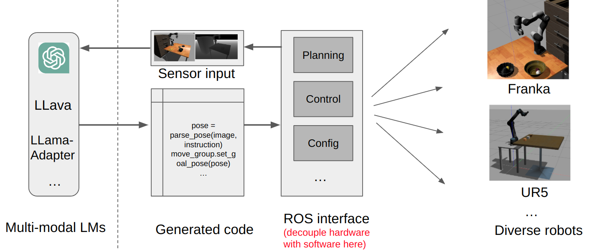
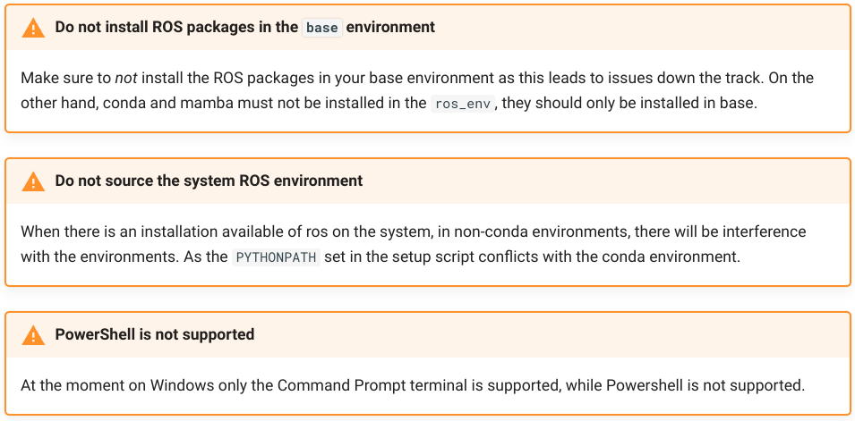

# LLM-manipulation Benchmark

This benchmark is to evaluate the performance of different multimodal large language models (LLM) on the task of code generation for object manipulation. The task is to generate python script to control a robotic arm to execute tasks specified in natural language instructions.

To minimize the sim-to-real gap in code generation for robotics control, the whole pipeline is built on ROS (Robot Operating System) and Gazebo simulation. Thus the generated code tested in Gazebo can be directly deployed to control real robots. Project overview:


## Installation

**Please read the notes below carefully before installing anything:**


The whole package runs on ROS 1 Noetic. You are recommended to use [Robostack](https://robostack.github.io/GettingStarted.html) to install & run ROS inside conda environment since you  need multiple conda environments for different models. It is a well-known issue that native ROS 1 environment is not compatible with conda environment, so Robostack is here to help. You can anyway install original ROS packages in your system as written in the official [ROS installation guide](http://wiki.ros.org/noetic/Installation/Ubuntu). Though DO NOT source the ROS environment (or comment out it in your .bashrc if you already setup one) in your terminal when you are using Robostack. Warnings from Robostack installation guide: 



The components needed for this project:
- Franka ROS: Integration of [libfranka](https://frankaemika.github.io/docs/libfranka.html) and [ROS control](https://wiki.ros.org/ros_control), which provides low-level connection/ low-level control to Franka robots.
- [MoveIt](https://ros-planning.github.io/moveit_tutorials/doc/getting_started/getting_started.html): Full-stack library for robot mobile manipulation: planning, manipulation, perception, kinematics, control. 
- Code generation dependencies.
- (Optional) any your custom model dependencies.

### Download and Install mamba

You should download the mamba package manager to install the dependencies. Mamba is a faster version of conda, which is used to install the C++/python/ROS dependencies in this project.

There are two ways you can install mamba: 1) Fresh install with miniforge 2) Existing conda install (not recommended)

For the fresh install, see [Fresh Insall](https://mamba.readthedocs.io/en/latest/installation/mamba-installation.html#fresh-install-recommended). If you have previously installed conda environment, please disable it by commentting out the conda init scritps in ~/.bashrc or ~/.zshrc. See [miniforge](https://github.com/conda-forge/miniforge#mambaforge) for download and initialization.

If you do want to keep using your installed conda environment, please refer to [Existing conda install (not recommended)](https://mamba.readthedocs.io/en/latest/installation/mamba-installation.html#existing-conda-install-not-recommended) in the official document. You might need to resolve environment conflicts manually.

### Install ROS environment with Robostack

Assuming you have installed conda and mamba in your computer. Create a new environment with conda-forge and robostack channels:

**Special tip for CHINESE users: Make sure you have full access to Internet or enable proxy. Conda mirrors will NOT work. You need to access robostack channel to install ros packages.** 

```bash
mamba create -n ros_env
mamba activate ros_env

# this adds the conda-forge channel to the new created environment configuration 
conda config --env --add channels conda-forge
# and the robostack channel
conda config --env --add channels robostack-staging
# remove the defaults channel just in case, this might return an error if it is not in the list which is ok
conda config --env --remove channels defaults
```

Install ROS1 Noetic:
```bash
# Install ros-noetic into the environment (ROS1)
mamba install ros-noetic-desktop-full
```

Install common tools and dependency pacakges:
```bash
# Reactivate the environment to initialize the ros env
mamba deactivate
mamba activate ros_env

# Install ros-noetic common dev tools and pin gcc/g++ version
mamba install gcc=9.5.0 gxx=9.5.0 compilers cxx-compiler cmake pkg-config make ninja colcon-common-extensions catkin_tools boost-cpp ros-noetic-ros-numpy

# Install ros gazebo packages
mamba install ros-noetic-gazebo-ros-pkgs

# Install realsense ros packages and image processing packages
mamba install ros-noetic-realsense2-camera ros-noetic-realsense2-description ros-noetic-librealsense2 ros-noetic-image-pipeline

# Install MoveIt ROS Packages
mamba install ros-noetic-moveit=1.1.11 ros-noetic-geometric-shapes=0.7.3

# Install Franka ROS Packages
mamba install ros-noetic-franka-ros

# Until Nov 2023, there is no pre-built packages in robostack for universal robots, so we need to build from source later
```

### Prepare your catkin workspace 

```bash
# make sure you have activated the ros environment
mamba activate ros_env
# create a catkin workspace
mkdir -p /path/to/catkin_ws/src
cd /path/to/catkin_ws
catkin init
cd /path/to/catkin_ws/src
git clone --recurse-submodules https://github.com/SgtVincent/llm-manipulation-bench.git
```


### Build the catkin packages

```bash
cd /path/to/catkin_ws
catkin build
```


### Install code generation dependencies:
```bash
# code generation dependencies
pip install numpy==1.23 astunparse scipy shapely astunparse pygments openai open3d imageio==2.4.1 imageio-ffmpeg moviepy
```


### Dev tools and tests builds

You can **skip this section** if you are not developing this project.

Please refer to [dev_builds.md](dev_builds.md) for more details.


### Troubleshooting 

Bug of `ros-noetic-genpy` 0.6.15 with gazebo:

```
[ERROR] [xxxxx]: Unpause physics service call failed: transport error completing service call: receive_once[/gazebo/unpause_physics]: DeserializationError cannot deserialize: unknown error handler name 'rosmsg'
```
Solution: Upgrade `ros-noetic-genpy` to 0.6.16 by building from source:

```bash
cd /path/to/catkin_ws/src
git clone --branch 0.6.16 https://github.com/ros/genpy.git
cd ..
catkin build genpy
```

Python 3.9 no longer supports thread.isAlive() method:

```bash
AttributeError: 'Thread' object has no attribute 'isAlive'
```

Solution: https://transang.me/add-apt-repository-does-not-work-after-updating-to-python-3-9/

Numpy >= 1.24 removed `np.float` property, which is used in `ros_numpy`:
```
AttributeError: module 'numpy' has no attribute 'float'.
```
Solution: `numpy` downgrade to `<1.24`


If you had some link failures during catkin make, please add the corresponding libraries to `target_link_libraries()` in the cmake file of moveit_tutorials (depending on the OS). 

## Test the environment installation

Before proceeding to the next step, please make sure you have the ROS+Gazebo+Moveit environment ready. You can test the environment with the following command:

```bash
# make sure you have activated the ros environment
mamba activate ros_env
cd /path/to/catkin_ws
source devel/setup.bash

# launch the gazebo environment
roslaunch instruct_to_policy run_panda_moveit_gazebo.launch verbose:=true
```

You will see the Gazebo and Moveit rviz window pop up. You can test the robot controller by moving the robot arm in rviz.

## Build grasp detection package in a separate workspace

Please refer to [grasp_detection](grasp_detection/README.md) package for more details.

## Build grounding models pacakge in a separate workspace

TODO: move the grounding model to a separate ros package. 

Please refer to [grounding_model](instruct_to_policy/scripts/src/grounding_model/README.md) package for more details.

## Data preparation

Please download the preprocessed data from:

[Baidu Cloud](https://pan.baidu.com/s/1RFtRa8DKPcVd5jP6b_g57A?pwd=7yxv)

[Google Drive]()

Please refer to [data](instruct_to_policy/data.md) for more details.

## Run

Please refer to [instruct_to_policy](instruct_to_policy/README.md) package for more details.
