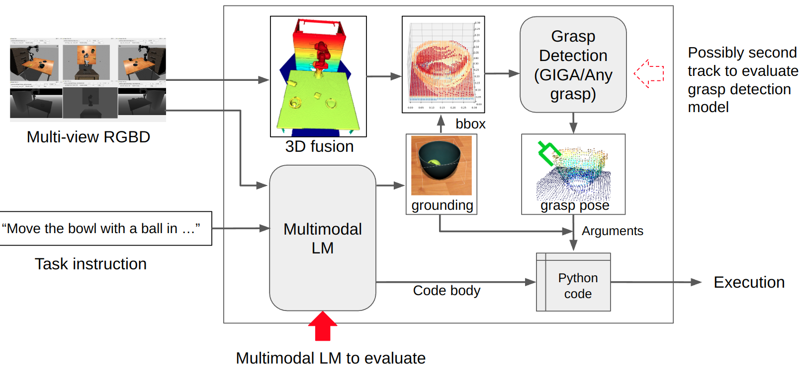

# Instruct_to_policy Module

Modules and pipeline: 


## Data pre-process

You can download the processed data for evaluation from [ADD_LINK_HERE](#).

You can also refer to the [data document](./data.md)s more details about the data generation process to process your custom data.

## Inetractive Demo with JupyterRos (Optional)

You might need some hack to install jupyter ros with ipython kernel aware of ros workspace. Please refer to [Installation](https://jupyter-ros.readthedocs.io/en/latest/user_installation.html) and [Troubleshooting](https://jupyter-ros.readthedocs.io/en/latest/user_troubleshooting.html) for more details. 

Until Dec. 2023, jupyter-ros is still under active development and you might always refer to its github issues for any problems. Skip this section if you don't need to run the interactive demo or you have much trouble installing jupyter-ros.

There are two demos demonstrating how to use [true_grounding_env.py](./scripts/src/env/true_grounding_env.py) and [multimodal_env.py](./scripts/src/env/multimodal_env.py) in [simple_env_interface.ipynb](./scripts/simple_env_interface.ipynb) and [example_multimodal_pipeline.ipynb](./scripts/example_multimodal_pipeline.ipynb) respectively.

**Read through the notebooks would also help you understand the pipeline and the modules.**

## Code Generation and Evaluation

### Code Generation

We provide a set of pre-defined worlds and tasks for benchmarking. You can find them in the `data/benchmark` directory. 

Under [task_queries](./data/benchmark/task_queries), you can find the task queries for each world. Each task query file has the same name as the corresponding world file.

You can generate the code for each task query with the following command:

```bash
roscd instruct_to_policy
python scripts/data/generate_code.py \
        --task-queries ./data/benchmark/task_queries/world_1_table_sort.txt \
        --output-dir ./data/benchmark/generated_code
```
you can refer to script [generate_code.py](./scripts/data/generate_code.py) to customize your own code generation process.

### Evaluation

#### Run Gazebo and Moveit

Launch all gazebo and moveit services/plugins you need for the task:

```bash
roslaunch instruct_to_policy run_panda_moveit_gazebo.launch world:=$(rospack find instruct_to_policy)/data/benchmark/worlds/world_1_table_sort.world
# or roslaunch instruct_to_policy run_ur5_moveit_gazebo.launch world:=$(rospack find instruct_to_policy)/data/benchmark/worlds/world_1_table_sort.world
```

By default, this launch file enables gazebo to publish ground truth object bounding boxes to moveit planning scene and environment. If you are evaluating the multi-modal pipeline with robot perception pipeline enabled, you should disable this feature by setting `use_gt_planning_scene:=false` in the launch file:
    
```bash
roslaunch instruct_to_policy run_panda_moveit_gazebo.launch world:=$(rospack find instruct_to_policy)/data/benchmark/worlds/world_1_table_sort.world use_gt_planning_scene:=false
```

Also, our environment waits until all required services are ready. e.g. The environment by defaults waits for grasp detection service to be ready. You should launch this service in grasp detection environment. Please refer to the [grasp_detection](../grasp_detection/README.md) package for more details. The case is similar for grounding model and other services dependant on your task. 

#### Run code evaluation

With gazebo, moveit and other services ready, you can run the code evaluation with the following command:

```bash
roscd instruct_to_policy
rosrun scripts/eval_generated_code.py \
    _world_name:=world_1_table_sort \
    _code_to_eval:=generated_code
```

The evaluation results should be in `data/benchmark/eval_results/` by default. 

## Run

Make sure you have activated the ROS environment and catkin workspace:
```bash
mamba activate <your_ros_env>
cd /path/to/catkin_ws
source devel/setup.bash
```

### TODO: Add the real-time run demo here 


## Troubleshooting

### Gazebo plugins

Our locally-built plugins are in `/path/to/catkin_ws/devel/lib`. To load it in gazebo, you should specify the LD_LIBRARY_PATH to the directory of the plugin. 

```bash
e.g. export LD_LIBRARY_PATH=/path/to/catkin_ws/devel/lib
```

## TODO List

- [x] Try to decouple the ros plugins and the robot urdf model.
